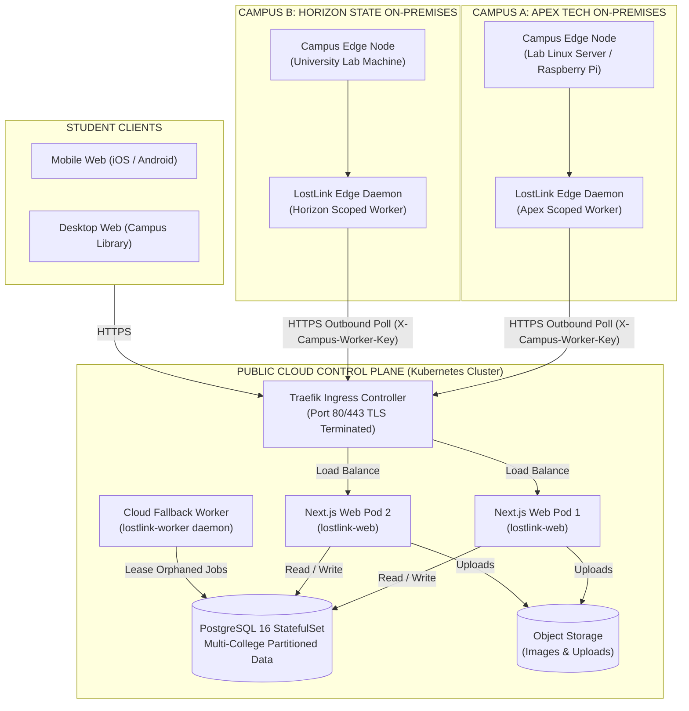
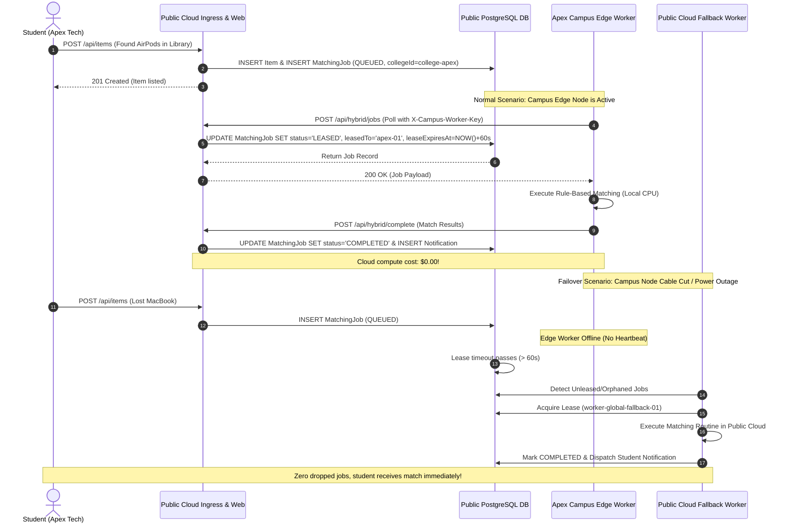

# LostLink 2.0 — Hybrid Architecture Diagrams & Data Flow Topology

## 1. Hybrid-Cloud Physical and Logical Topology

```mermaid
graph TD
    subgraph Public_Cloud_Control_Plane["PUBLIC CLOUD CONTROL PLANE (Kubernetes Cluster)"]
        Ingress["Traefik Ingress Controller<br/>(Port 80/443 TLS Terminated)"]
        Web1["Next.js Web Pod 1<br/>(lostlink-web)"]
        Web2["Next.js Web Pod 2<br/>(lostlink-web)"]
        Postgres[("PostgreSQL 16 StatefulSet<br/>Multi-College Partitioned Data")]
        FallWorker["Cloud Fallback Worker<br/>(lostlink-worker daemon)"]
        S3[("Object Storage<br/>(Images & Uploads)")]
        
        Ingress -->|Load Balance| Web1
        Ingress -->|Load Balance| Web2
        Web1 -->|Read / Write| Postgres
        Web2 -->|Read / Write| Postgres
        Web1 -->|Uploads| S3
        Web2 -->|Uploads| S3
        FallWorker -->|Lease Orphaned Jobs| Postgres
    end

    subgraph Campus_A_Edge["CAMPUS A: APEX TECH ON-PREMISES"]
        ApexNode["Campus Edge Node<br/>(Lab Linux Server / Raspberry Pi)"]
        ApexWorker["LostLink Edge Daemon<br/>(Apex Scoped Worker)"]
        ApexNode --> ApexWorker
    end

    subgraph Campus_B_Edge["CAMPUS B: HORIZON STATE ON-PREMISES"]
        HorizonNode["Campus Edge Node<br/>(University Lab Machine)"]
        HorizonWorker["LostLink Edge Daemon<br/>(Horizon Scoped Worker)"]
        HorizonNode --> HorizonWorker
    end

    subgraph Student_Clients["STUDENT CLIENTS"]
        Mobile["Mobile Web (iOS / Android)"]
        Desktop["Desktop Web (Campus Library)"]
    end

    Student_Clients -->|HTTPS| Ingress
    ApexWorker -->|"HTTPS Outbound Poll (X-Campus-Worker-Key)"| Ingress
    HorizonWorker -->|"HTTPS Outbound Poll (X-Campus-Worker-Key)"| Ingress
```

---

## 2. Dynamic Hybrid Failover Sequence Diagram

```mermaid
sequenceDiagram
    autonumber
    actor Student as Student (Apex Tech)
    participant CloudWeb as Public Cloud Ingress & Web
    participant CentralDB as Public PostgreSQL DB
    participant CampusEdge as Apex Campus Edge Worker
    participant CloudWorker as Public Cloud Fallback Worker

    Student->>CloudWeb: POST /api/items (Found AirPods in Library)
    CloudWeb->>CentralDB: INSERT Item & INSERT MatchingJob (QUEUED, collegeId=college-apex)
    CloudWeb-->>Student: 201 Created (Item listed)

    Note over CampusEdge,CentralDB: Normal Scenario: Campus Edge Node is Active
    CampusEdge->>CloudWeb: POST /api/hybrid/jobs (Poll with X-Campus-Worker-Key)
    CloudWeb->>CentralDB: UPDATE MatchingJob SET status='LEASED', leasedTo='apex-01', leaseExpiresAt=NOW()+60s
    CentralDB-->>CloudWeb: Return Job Record
    CloudWeb-->>CampusEdge: 200 OK (Job Payload)
    CampusEdge->>CampusEdge: Execute Rule-Based Matching (Local CPU)
    CampusEdge->>CloudWeb: POST /api/hybrid/complete (Match Results)
    CloudWeb->>CentralDB: UPDATE MatchingJob SET status='COMPLETED' & INSERT Notification
    Note over CampusEdge,CloudWeb: Cloud compute cost: $0.00!

    Note over CampusEdge,CloudWorker: Failover Scenario: Campus Node Cable Cut / Power Outage
    Student->>CloudWeb: POST /api/items (Lost MacBook)
    CloudWeb->>CentralDB: INSERT MatchingJob (QUEUED)
    Note over CampusEdge: Edge Worker Offline (No Heartbeat)
    CentralDB->>CentralDB: Lease timeout passes (> 60s)
    CloudWorker->>CentralDB: Detect Unleased/Orphaned Jobs
    CloudWorker->>CentralDB: Acquire Lease (worker-global-fallback-01)
    CloudWorker->>CloudWorker: Execute Matching Routine in Public Cloud
    CloudWorker->>CentralDB: Mark COMPLETED & Dispatch Student Notification
    Note over CloudWorker,Student: Zero dropped jobs, student receives match immediately!
```
